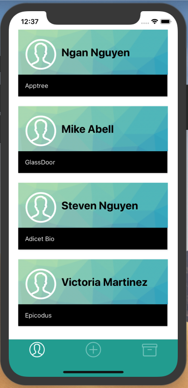
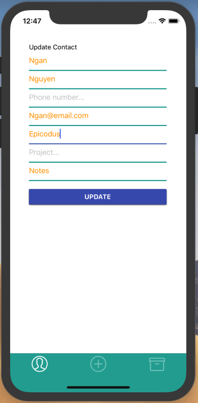

<h3 align="center"> Crm App </h3>
<h4 align="center"> By Ngan Nguyen </h4>

## Description

_This mobile app is a simple crm app to hold contacts, with CRUD functionality._

## Demo

# 
# 

## Application Component Hierarchy
1. App
2. AddPerson
3. CompanyList
4. DetailView
5. Navigation
6. PeopleDetail
7. PeopleItem
8. PeopleList
9. UpdatePerson

## Technology
* Javascript
* React Native
* Material UI
* Mongo DB

## Installation

## License
* This project is licensed under the MIT License - see the LICENSE.md file for details
